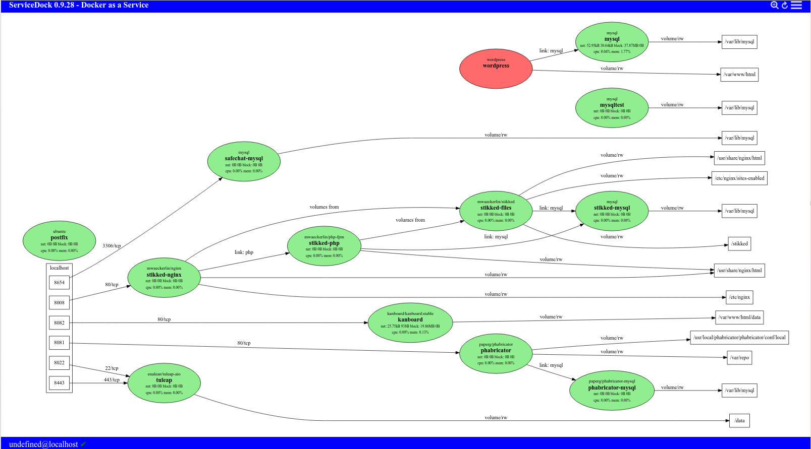

# docker.js

NodeJS Module for Handling and Displaying Docker Information

## Screen Shot

## Server Side

code snipped from usage on server side

    var express = require('express');
    var app = express.createServer();
    var docker = require('docker.js')(app);
    
    function create(data) {
      console.log("-> create");
      var d = new docker.Docker();
      var dc = new d.Containers();
      createContainer(dc.creation(data));
    }

## Client Side

code snipped from usage on client side

    <!DOCTYPE HTML>
    <html>
      <head>
        
        
      </head>
      …
    </html>

    var docker = new Docker();
    var focused = null;
    
    function showviz(vizpath, more) {
      res = "digraph {\n"+vizpath+"\n}";
      showinhtml(Viz(res)); // put svg to browser screen
    }

    function overview() {
      focused = null;
      showviz(docker.containers.graph());
    }

    function details(name) {
      if (name) focused = name;
      else if (!focused) return overview();
      showviz(docker.containers.subgraph(focused));
    }
